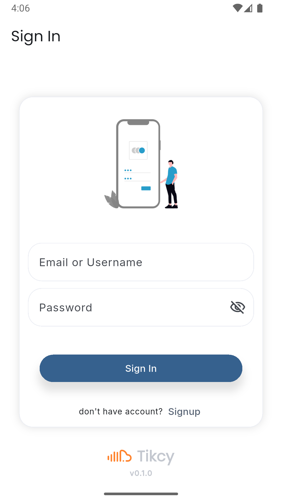
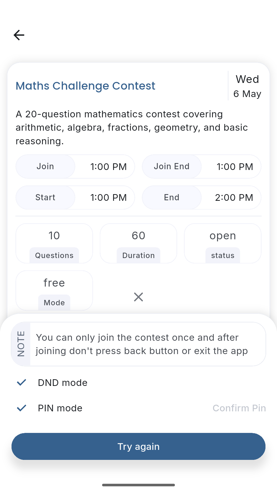
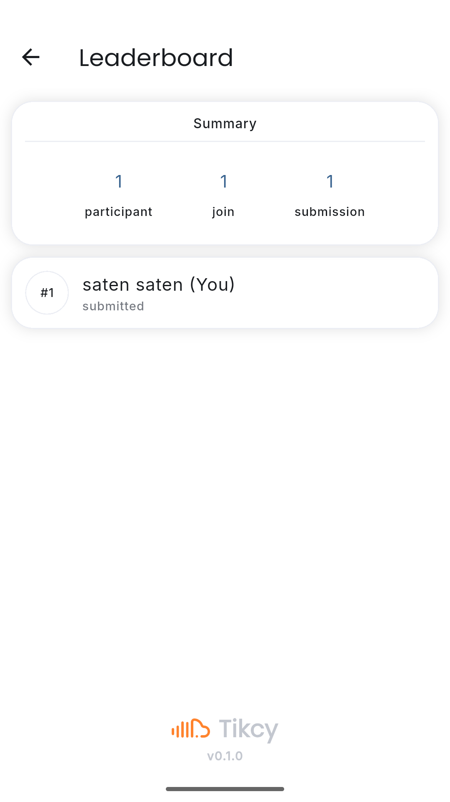
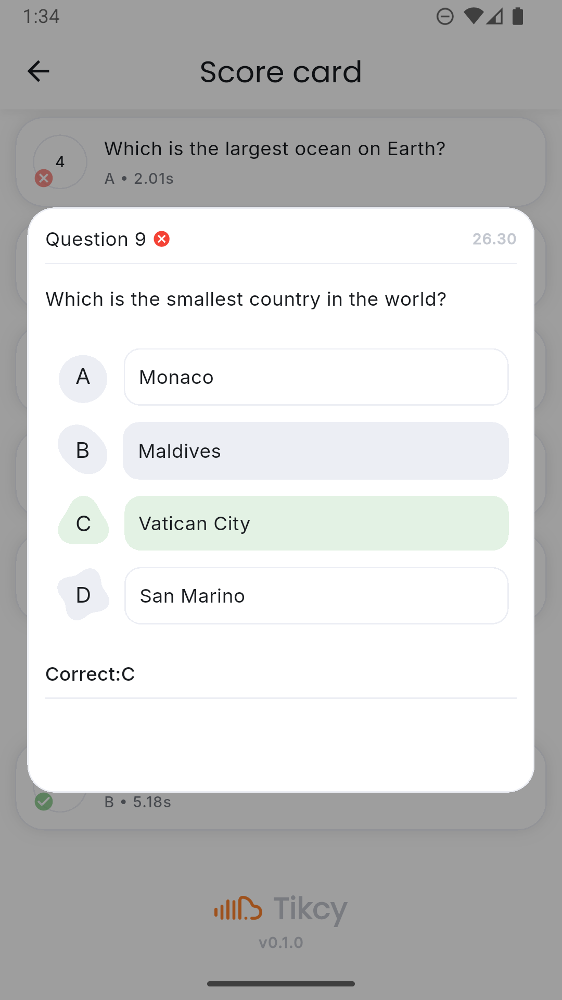

# Ticky

A modern Flutter application designed for performance and scalability.

## 📱 Preview

| SignIn | HomePage | Features | LeaderBoard | Scorecard |
| :---: | :---: | :---: | :---:| :---: |
 | ||  |  | 

---

## Getting Started

Follow these instructions to get a copy of the project up and running on your local machine for development and testing.

### 1. Clone the Repository

First, clone the project from GitHub and navigate into the directory:
```bash
git clone https://github.com/yourusername/quthon.git
cd quthon
flutter pub get
flutter run 
